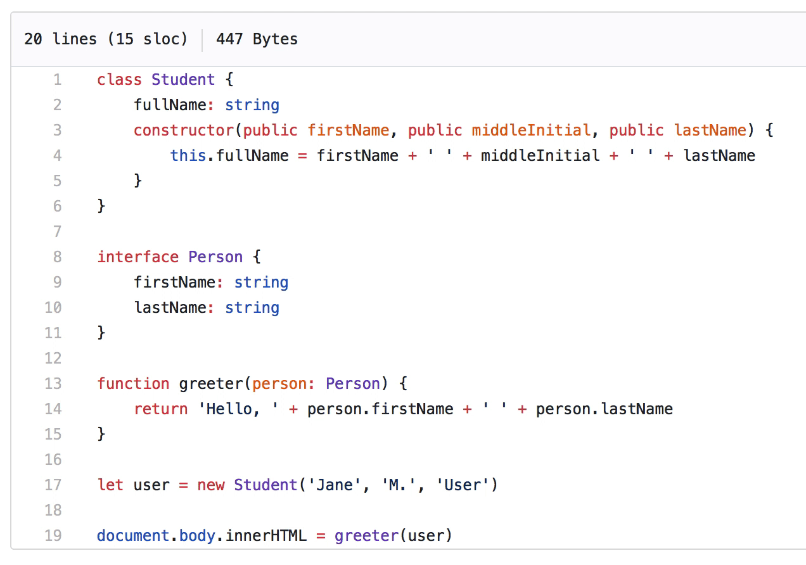

# Octohint

## Introduction

Octohint is a browser extension which adds IntelliSense hint feature to GitHub.

[Introduction at Medium](https://medium.com/@pd4d10/introducing-octohint-e1a3e4b80c47)

## Installation

### Chrome

Install it from [Chrome Web Store](https://chrome.google.com/webstore/detail/octohint/hbkpjkfdheainjkkebeoofkpgddnnbpk)

Manual installation:

Go to [release page](https://github.com/pd4d10/octohint/releases), find `chrome.zip` file, download and unpack it.

### Firefox

Follow [this guide](https://developer.mozilla.org/en-US/Add-ons/WebExtensions/Temporary_Installation_in_Firefox). The file is the same as manual installation of Chrome.

Make sure your version of Firefox supports web extensions. 

### Opera

Use this extension: [Install Chrome Extensions](https://addons.opera.com/en/extensions/details/download-chrome-extension-9/) to install Octohint from [Chrome Web Store](https://chrome.google.com/webstore/detail/octohint/hbkpjkfdheainjkkebeoofkpgddnnbpk)

### Safari

1. Download [this zip file](https://github.com/pd4d10/octohint/releases/download/v2.0.1/octohint.safariextension.zip), double click to unpack it in Finder

2. [Enable Develop tools of Safari](https://developer.apple.com/library/content/documentation/AppleApplications/Conceptual/Safari_Developer_Guide/GettingStarted/GettingStarted.html)

3. At top menubar, click Develop -> Show Extension builder, then click '+' on the bottom left corner of popup window, choose 'Add Extension', then select unpacked folder on step 1.

4. Click 'Install' button on the top right, done.

## Features

With Octohint installed, when you view code at GitHub (For example [this demo](https://github.com/pd4d10/octohint/blob/master/assets/demo.ts)), you'll get features as follows:

* Mouse Hover: Show information of current token
* Left Click: Show all references of current token
* [⌘] + Click: Go to definition of current token (For Windows and Linux user, use [Ctrl] instead)

## Supported languages

Octohint supports all languages. There are two strategies:

* IntelliSense hint: TypeScript, JavaScript, CSS, LESS, SCSS
* Simple token matching: All other languages

It is because browser only runs JavaScript. But with help of WebAssembly, maybe we could bring other languages(like Go/Rust)' IntelliSense analysis to browser! It's still in research

## Supported platforms

Support GitHub, GitLab and Bitbucket. Since GitLab CE has many versions, I'm not sure it works correctly on every version. If you find some bugs you could [submit an issue](https://github.com/pd4d10/octohint/issues/new).

## Get your private site works

If GitHub/GitLab/Bitbucket you are using is hosted on different site, go to chrome://extensions, click options of Octohint, then add [match patterns](https://developer.chrome.com/extensions/match_patterns) of your site, like `https://www.example.com/*`.

## Privacy policy

Octohint is a pure client thing. All code analysis are performed at your browser, which means your code and actions log like click, mousemove will never be sent to any server.

Feel free to use it at your private GitHub/GitLab/Bitbucket.

## Related

* [Octoview](https://github.com/pd4d10/octoview): The missing preview feature for GitHub

## License

MIT
